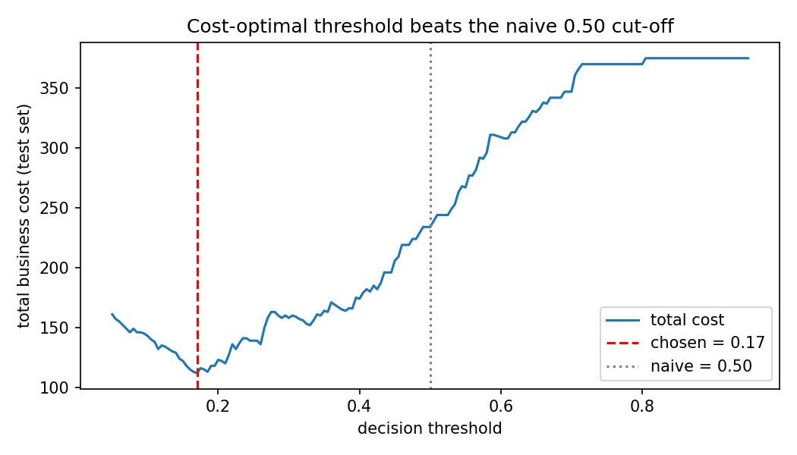
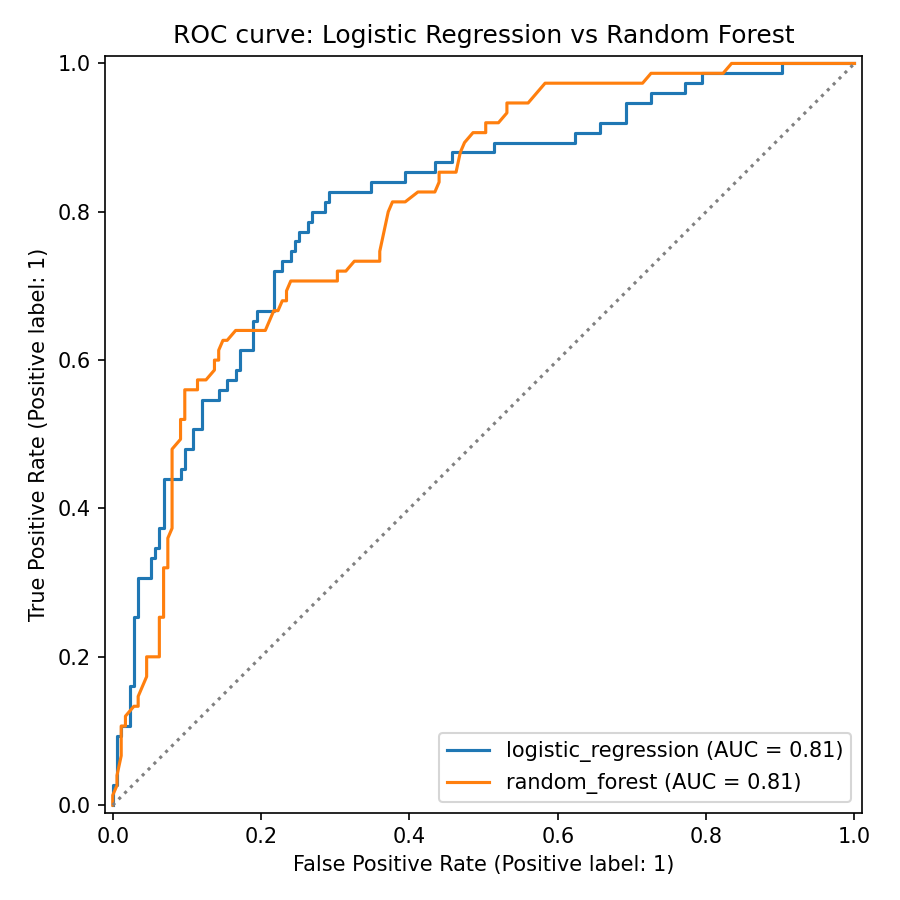
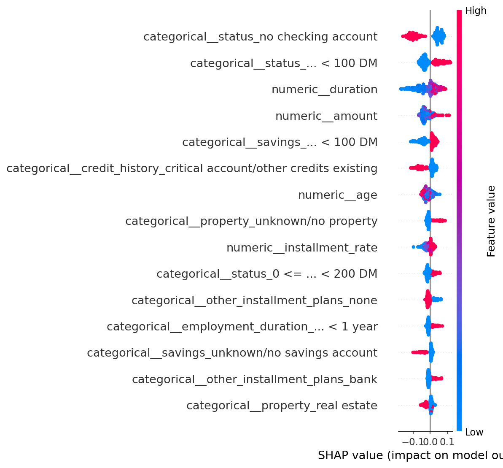

# Credit Risk Model — Loan Default Prediction with Cost-Sensitive Decisions

A production-style machine-learning pipeline that predicts loan defaults and
converts those predictions into **cost-optimal approve/reject decisions**, with
per-applicant SHAP explanations that satisfy US fair-lending law.

Built in Python with scikit-learn and SHAP on the UCI German Credit dataset
(1,000 real loan applications, 20 features).

## Headline result

Tuning the decision threshold to the bank's cost matrix **cut total business
cost by 52%** on the held-out test set — with no change to the model itself.
The final model catches **97% of defaults (73 of 75)** at the cost-optimal
threshold.



The grey dotted line is where a default model stops thinking. The red dashed
line is where a bank stops thinking. That's the whole project in one chart.

## Why this project is framed the way it is

Anyone can call `model.fit()`. What matters in a bank context is three things
this project is built around:

1. **The two mistakes aren't equal.** Approving a loan that later defaults
   costs a lender far more than rejecting a customer who would have repaid.
   The German Credit dataset ships with an official 5:1 cost ratio, and this
   project optimizes for *cost*, not accuracy.

2. **The decision threshold is a business lever.** Because of the asymmetry
   above, the model should reject more aggressively than a naive 50% cutoff.
   Threshold tuning delivered the 52% cost reduction — no model change.

3. **The model must explain itself.** Under the US Equal Credit Opportunity
   Act (ECOA), a lender denying credit must send an adverse action notice
   listing the specific principal reasons. SHAP generates those reason codes.

## Results (held-out test set, 250 applicants)

| Model | ROC-AUC | Cost @ 0.50 (naive) | Cost @ tuned threshold | Defaults caught |
|---|---|---|---|---|
| Logistic Regression | 0.807 | 123 | 116 (t=0.47) | 62 / 75 |
| **Random Forest (selected)** | 0.806 | 234 | **112 (t=0.17)** | **73 / 75** |

### The models rank risk nearly identically (ROC)


### What drives risk globally (SHAP summary)


Top drivers — low checking balance, short employment history, long loan
duration — are legitimate credit signals, not protected characteristics.
This is a fair-lending audit pass.

## How to run

```bash
git clone https://github.com/Sravya1211/Credit-Risk-Model.git
cd Credit-Risk-Model
pip install -r requirements.txt
python -m src.train        # trains, evaluates, writes reports/ + figures
pytest -q                  # runs the test suite
```

## Project structure

Credit-Risk-Model/
├── src/
│ ├── config.py # paths, column groups, cost matrix constants
│ ├── data.py # download, cache, target inversion, stratified split
│ ├── features.py # scaling + one-hot encoding in one ColumnTransformer
│ ├── model.py # two pipelines, cost function, threshold search
│ ├── explain.py # SHAP: global summary + per-applicant reason codes
│ └── train.py # orchestrator: run everything, save metrics + figures
├── tests/ # pytest suite (data, preprocessing, cost, thresholds)
├── reports/ # metrics.json + generated figures
├── pytest.ini
├── requirements.txt
└── README.md

## Design choices worth noting

- **Everything is a scikit-learn `Pipeline`.** Preprocessing and the estimator
  are bundled together, so the exact same transformation runs at training and
  prediction time. This prevents the classic "train/serve skew" bug.
- **Stratified train/test split** preserves the ~30% default rate in both
  halves, so the test score isn't distorted by an unlucky shuffle.
- **`class_weight="balanced"`** keeps the ~30% minority class from being
  ignored by the optimizer.
- **Two models on purpose:** logistic regression is the interpretable industry
  baseline for credit scoring; the random forest is a stronger benchmark and
  the basis for the SHAP explanations.
- **A `pytest` suite** locks in critical behaviors (data shape, target
  inversion direction, no train/test overlap, cost function weights).

## Data

UCI German Credit dataset — 1,000 applications labeled good/bad credit.
Public mirror, no authentication required. Original: Hofmann, H. (1994), UCI
Machine Learning Repository.
